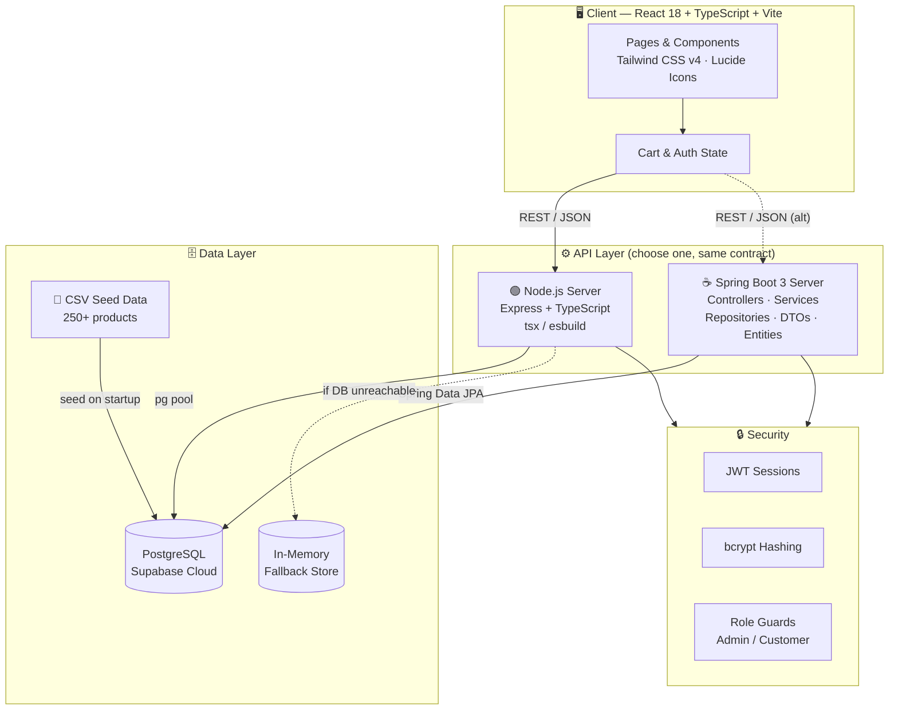
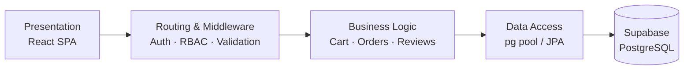
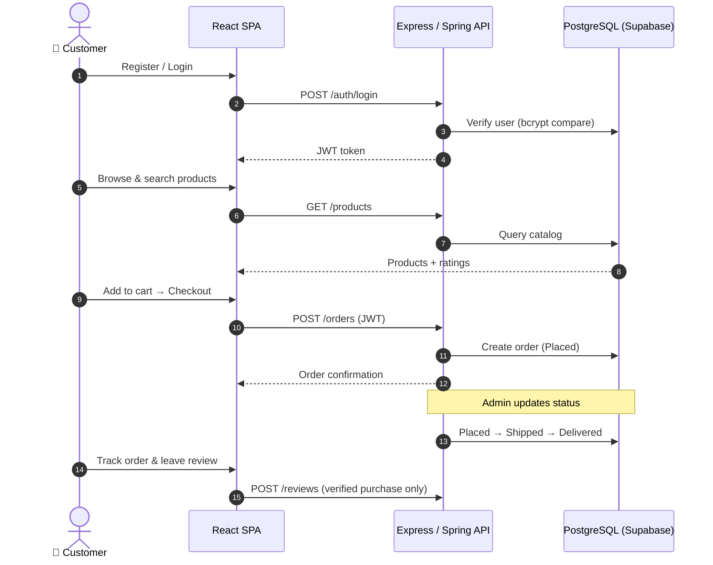
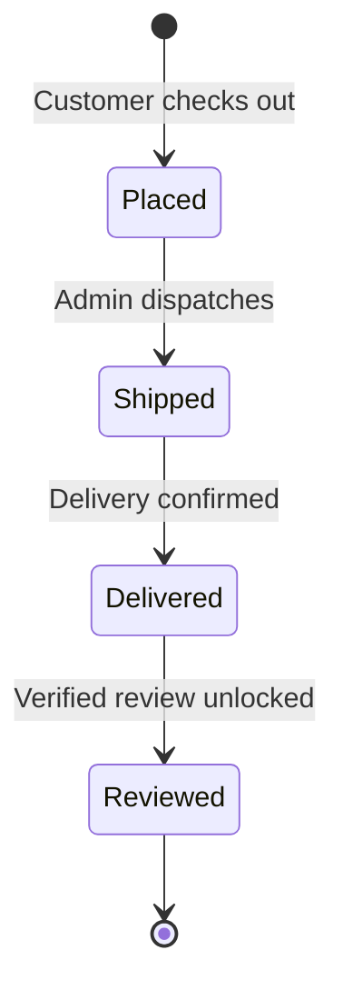
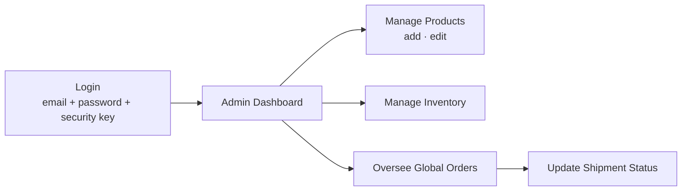

<div align="center">


<a href="https://git.io/typing-svg">
  
</a>

<br/>


</div>

---

## 📑 Table of Contents

- [🌟 Project Overview](#-project-overview)
- [✨ Key Features](#-key-features)
- [🏗️ System Architecture](#️-system-architecture)
- [🛠️ Tech Stack](#️-tech-stack)
- [📂 Repository Structure](#-repository-structure)
- [🔄 Workflow](#-workflow)
- [🚀 How to Run](#-how-to-run)
- [🔐 Demo Accounts](#-demo-accounts)
- [🔮 Future Improvements](#-future-improvements)
- [⚠️ Disclaimer](#️-disclaimer)
- [👩‍💻 Author](#-author)
- [🤝 Support](#-support)

---

## 🌟 Project Overview

**E-Commerce & Order Management Platform** is an enterprise-grade, high-performance system that covers the full shopping lifecycle: **discover → cart → checkout → track → review**, plus an exclusive **Administrator portal** for managing products, inventory and orders globally.

The platform follows a **full-stack monorepo** approach and ships with **two interchangeable backends** (Node.js/Express and Java/Spring Boot) that talk to the **same Supabase PostgreSQL database**, demonstrating clean API design and backend portability.

| 🎯 Goal | 💡 Solution |
|---|---|
| Fast, smooth shopping experience | React 18 + Vite SPA with instant HMR and utility-first Tailwind UI |
| Secure access | JWT stateless sessions, bcrypt hashing, role-based access (Admin / Customer) |
| Operational control | Admin dashboard for catalog, inventory and global order oversight |
| Trustworthy feedback | Reviews allowed only on **verified purchases** |
| High availability | In-memory fallback store when the cloud DB connection drops |

---

## ✨ Key Features

<table>
<tr>
<td width="50%">

### 🛍️ Customer Experience
- 🔎 **Product Catalog & Search** — 250+ seeded products with categories, ratings and rich descriptions
- 🛒 **Real-time Cart** — interactive cart management
- 💳 **Secure Checkout** — smooth order placement
- 📦 **Live Order Tracking** — `Placed → Shipped → Delivered`
- ⭐ **Verified Reviews** — only for products you've purchased

</td>
<td width="50%">

### 🛡️ Admin & Platform
- 👑 **Admin Portal** — add / edit products, manage inventory, oversee all orders
- 🔐 **RBAC Authentication** — JWT + bcrypt with Admin vs Customer roles
- 🗝️ **Extra Admin Security Key** at login
- 🌱 **Auto Seeding** — CSV parsing loads products on startup
- 🧯 **Resilient** — in-memory fallback database

</td>
</tr>
</table>

---

## 🏗️ System Architecture



### 🧩 Layered View



---

## 🛠️ Tech Stack

<div align="center">

| Layer | Technologies |
|:---:|:---|
| **Frontend** |      |
| **Backend (Primary)** |     |
| **Backend (Companion)** |     |
| **Database** |   |
| **Security** |   |
| **Tooling** |   |

</div>

---

## 📂 Repository Structure

> 📝 *Adjust folder names below to match your actual repository if they differ.*

```text
Ecommerce-Order-Management-Platform/
│
├── 📁 src/                      # React + TypeScript frontend (Vite)
│   ├── 📁 components/           # Reusable UI components
│   ├── 📁 pages/                # Catalog, Cart, Checkout, Orders, Admin
│   ├── 📁 context/              # Auth & Cart state
│   ├── 📁 services/             # API client helpers
│   ├── 📄 App.tsx
│   └── 📄 main.tsx
│
├── 📁 server/                   # Node.js + Express backend (primary)
│   ├── 📁 routes/               # auth, products, cart, orders, reviews, admin
│   ├── 📁 middleware/           # JWT verification, role guards
│   ├── 📁 db/                   # pg pool, in-memory fallback, CSV seeding
│   └── 📄 server.ts
│
├── 📁 src/main/java/...         # Spring Boot backend (companion)
│   ├── 📁 controller/
│   ├── 📁 service/
│   ├── 📁 repository/
│   ├── 📁 dto/
│   └── 📁 entity/
│
├── 📁 data/                     # CSV seed data (250+ products)
├── 📄 .env.example              # Environment template
├── 📄 package.json
├── 📄 pom.xml                   # Maven config (Java backend)
├── 📄 mvnw / mvnw.cmd           # Maven wrapper
├── 📄 vite.config.ts
└── 📄 README.md
```

---

## 🔄 Workflow

### 🧭 Customer Journey



### 📦 Order Lifecycle



### 👑 Admin Flow



---

## 🚀 How to Run

### ✅ Prerequisites

- **Node.js** v18 or higher
- **Git**
- *Optional:* **Java 17+** (only for the Spring Boot backend)

### 1️⃣ Clone & Install

```bash
# Clone the repository
git clone https://github.com/MahalaxmiKouchika/Ecommerce-Order-Management-Platform.git
cd Ecommerce-Order-Management-Platform

# Install dependencies
npm install
```

### 2️⃣ Environment Setup

Create a `.env` file in the root directory (based on `.env.example`):

```env
DATABASE_URL=your_supabase_postgres_connection_string
JWT_SECRET=your_long_random_secret
# Add any additional Supabase keys required by .env.example
```

### 3️⃣ Run the Development Server (Node.js + React)

```bash
npm run dev
```

| Service | URL |
|---|---|
| 🌐 Frontend + API (same server) | `http://localhost:3000` |

> 💡 Keep the terminal running and open the link above to use the app.

### ☕ Alternative: Run the Java Spring Boot Backend

```bash
# Windows
.\mvnw.cmd spring-boot:run

# Mac / Linux
./mvnw spring-boot:run
```

### 🏭 Production Build (optional)

```bash
npm run build     # bundles the frontend and server (Vite + esbuild)
npm start         # runs the production bundle
```

---

## 🔐 Demo Accounts

Use these pre-configured **demo** accounts to explore the platform:

<table>
<tr>
<th>Role</th><th>Email</th><th>Password</th><th>Extra</th>
</tr>
<tr>
<td>👑 Administrator</td>
<td><code>admin@nexus.com</code></td>
<td><code>Admin@Secure2025</code></td>
<td>Security Key: <code>ADM-SECURE-9481</code></td>
</tr>
<tr>
<td>🛍️ Verified Customer</td>
<td><code>customer@nexus.com</code></td>
<td><code>Customer@123</code></td>
<td>—</td>
</tr>
</table>

> 🚨 **Security note:** These credentials are for local demos only. Change or remove them, and rotate `JWT_SECRET`, before any real deployment.

---

## 🔮 Future Improvements

- [ ] 💳 Integrate real payment gateways (Stripe / Razorpay)
- [ ] 📧 Email & SMS notifications for order status changes
- [ ] 🔍 Advanced search with filters, sorting and full-text / fuzzy matching
- [ ] ❤️ Wishlist and product recommendations
- [ ] 📊 Admin analytics dashboard (sales, revenue, top products)
- [ ] 🧾 Invoice / PDF receipt generation
- [ ] 🔄 Returns, refunds and cancellation workflow
- [ ] 🎟️ Coupons, discounts and promotional campaigns
- [ ] 🐳 Docker & Docker Compose setup for one-command startup
- [ ] ⚙️ CI/CD pipeline with GitHub Actions (lint, test, deploy)
- [ ] 🧪 Unit, integration and end-to-end test coverage
- [ ] 🌍 Multi-language & multi-currency support
- [ ] 🔔 Real-time updates via WebSockets
- [ ] 🛡️ Rate limiting, refresh tokens, and 2FA for admins

---

## ⚠️ Disclaimer

This project is built for **educational and portfolio purposes**. Product data is seeded sample data, and no real payments or shipments are processed. The bundled demo credentials are intentionally public and must not be used in production. Use of this software is at your own risk.

---

## 👩‍💻 Author

<div align="center">


[](https://github.com/MahalaxmiKouchika)
[](www.linkedin.com/in/mahalaxmi-kouchika-308142372
)
[](mailto:mahalaxmikouchika2007@gmail.com@example.com)

</div>

---

## 🤝 Support

If you found this project helpful:

- ⭐ **Star** the repository
- 🍴 **Fork** it and build something new
- 🐛 Open an [issue](https://github.com/MahalaxmiKouchika/Ecommerce-Order-Management-Platform/issues) for bugs or feature requests
- 🔧 Submit a **pull request**, contributions are always welcome

<div align="center">

<br/>

**Made with ❤️ and lots of ☕ by Mahalakshmi**


</div>
